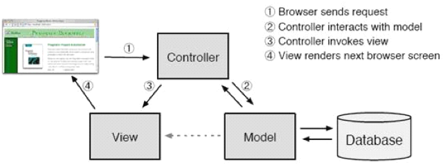
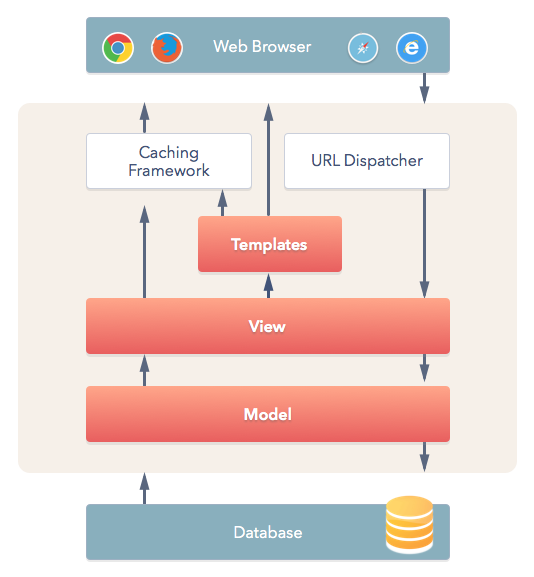

# Django 簡介

網路上有很多 Django 的文件及影片教學，想要自學的朋友，建議可以參考底下的網站：

* [Django Girls 學習指南](https://djangogirlstaipei.gitbooks.io/django-girls-taipei-tutorial/)
* [Django 基本教學](https://github.com/twtrubiks/django-tutorial)
* [Django-REST-framework 基本教學](https://github.com/twtrubiks/django-rest-framework-tutorial)
* [Try Django 1.10](https://github.com/codingforentrepreneurs/Try-Django-1.10)

我們課程上，主要是使用範例引導學員了解 Django 的一些核心概念。

需要了解的東西如下：

* MVC 的概念 及 Django 的 MTV 架構
* Project & App
* Hello World
  - 可以直接寫在 Project 裡面，如此就不需要建立 App
  - 也寫在 App 裡面的 views.py
  - 怎麼設定 settings.py
  - 怎麼設定 urls.py
* Views
  - Function Views
  - Class Views
* Templates
* Models
  - ORM (python manage.py shell)
  - django admin 後台
* Forms
  - Form classes
  - ModelForms
* Deployment
  - 選擇使用 pythonanywhere 做為佈署環境

## MVC 概念及 Django 的 MTV 架構

MVC 架構|Django的MTV架構
:-:|:-:
Model|Model
View|Template
Controller|View

Django 的 Views 分成 Function View 跟 Class View。

## Project & App

## 範例：

在這裡我們用下面的範例，來講解 Django 的概念。

hello1

* Hello World 程式
* 將 Function View 寫在 Project 的 urls.py 裡面。

hello2

* Hello World 程式
* 將 Function View 寫在 Project 的 views.py 裡面。

hello3

* Hello World 程式
* 將 Function View 寫在 App 的 views.py 裡面。

hello4

* Hello World 程式
* 將 http request 轉到 App 的 urls.py 裡面。

techanjs

* 使用 django 重作前面的 flask 的範例

mymodel

* 建立 models
* 練習 ORM
* 練習 python manage.py 的三個指令 makemigrations, migrate, shell
